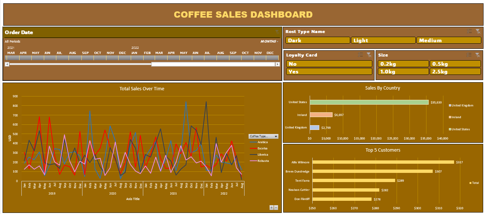

# ☕ Coffee Sales Dashboard using Excel

## 🎯 Objective
Create a dynamic and interactive Coffee Sales Dashboard using Excel to demonstrate data gathering, transformation, analysis, and visualization techniques.

## 🏗️ Project Overview
This project involved creating a Coffee Sales Dashboard that provides insights into coffee sales across different regions and customer segments. The dashboard includes the following key components:

- 📈 **Total Sales Over Time (Line Chart)**
- 📊 **Sales by Country (Bar Chart)**
- 🏅 **Top 5 Customers (Bar Chart)**
- 🎛️ **Interactive Timeline and Slicers for Data Filtering**

---

## 🛠️ Step-by-Step Process

### 📥 Data Gathering
- The dataset consisted of three tables:
  - 📋 **Orders:** Contains order details including Order ID, Order Date, Customer ID, Product ID, and Quantity.
  - 👥 **Customers:** Includes Customer ID, Name, Email, Country, and Loyalty Card status.
  - 🛍️ **Products:** Contains Product ID, Coffee Type, Roast Type, Size, Unit Price, and Profit.

- Missing data in the Orders table required data retrieval using lookup formulas.

### 🔧 Data Transformation
- **🔍 XLOOKUP Formula:**
  - Used to populate customer information (Name, Email, Country) into the Orders table.
  - Implemented error handling to replace missing values with blanks.

- **📌 INDEX MATCH Formula:**
  - Applied to dynamically gather product information (Coffee Type, Roast Type, Size, Unit Price).

- **💲 Sales Calculation:**
  - Computed by multiplying Unit Price with Quantity.

- **✏️ IF Functions:**
  - Translated abbreviations (e.g., 'Rob' to 'Robusta') into full coffee type names.

- **🎨 Formatting:**
  - Applied custom date and number formats.
  - Ensured size column displayed metric units (kilos).

- **🗑️ Duplicate Check:**
  - Used the "Remove Duplicates" function to ensure data integrity.

- **📦 Table Conversion:**
  - Converted the dataset into an Excel Table for easier pivot table updates.

---

## 🔍 Lookup, Indexing, Matching, and Locking in Detail

### 🔍 XLOOKUP
- **Purpose:** Retrieves a value by looking up a corresponding value in another table.
- **Syntax:**
```excel
=XLOOKUP(Lookup_value, Lookup_array, Return_array, [If_not_found], [Match_mode], [Search_mode])
```
- **Example:**
```excel
=XLOOKUP(C2, Customers!A2:A1000, Customers!B2:B1000, "", 0)
```
- Looks up the value in C2 within the Customers table, specifically column A, and returns the corresponding value from column B.
- **Error Handling:**
  - The fourth argument handles missing values by displaying a blank if not found.

### 🏷️ INDEX MATCH
- **Purpose:** Combines the power of INDEX (to retrieve a value) and MATCH (to find the row or column number) for dynamic lookups.
- **Syntax:**
```excel
=INDEX(Array, MATCH(Lookup_value, Lookup_array, [Match_type]), MATCH(Lookup_value, Lookup_array, [Match_type]))
```
- **Example:**
```excel
=INDEX(Products!A2:E1000, MATCH(D2, Products!A2:A1000, 0), MATCH(I1, Products!A1:E1, 0))
```
- Retrieves the value where the row matches D2 (Product ID) and the column matches I1 (Coffee Type).
- **Dynamic Nature:**
  - The use of MATCH for both row and column references makes this formula flexible when new columns are added.

### 🔒 Locking Ranges (Using F4)
- **Purpose:** Locks cell references to prevent them from shifting during formula replication.
- **Types of Locking:**
  - `$A$1`: Locks both row and column.
  - `A$1`: Locks row only.
  - `$A1`: Locks column only.
- **Usage:** Press F4 while editing a formula to toggle through locking options.
- **Example:**
```excel
=XLOOKUP(C2, Customers!$A$2:$A$1000, Customers!$B$2:$B$1000)
```
- Keeps the range constant regardless of how far the formula is dragged.

---

## 📊 Pivot Tables and Charts

### 📦 Pivot Table Creation
- **Total Sales:** Summarized sales by coffee type over time. Grouped order dates by year and month.
- **Sales by Country:** Summarized total sales per country.
- **Top 5 Customers:** Filtered top-performing customers by sales.

### 🖼️ Pivot Charts
- Created corresponding line and bar charts.
- Applied custom formatting for better visualization.

---

## 🎛️ Interactive Components

### 🕰️ Timeline and Slicers
- Inserted a timeline for date filtering.
- Added slicers for:
  - 🏷️ Roast Type
  - 📏 Coffee Size
  - 🏷️ Loyalty Card Status

- Applied custom styles to slicers and timeline for consistency.

---

## 🛠️ Dashboard Assembly



### 🏗️ Building the Dashboard
- Combined all charts, slicers, and timeline on a single dashboard.
- Customized layout and alignment.
- Removed gridlines and scrollbars for a clean look.
- Enabled user-friendly scrollbars for accessibility.

---

## 🎨 Final Touches
- Ensured all slicers and timelines filtered every chart.
- Applied consistent color schemes and borders.
- Optimized view settings for presentation.

---


